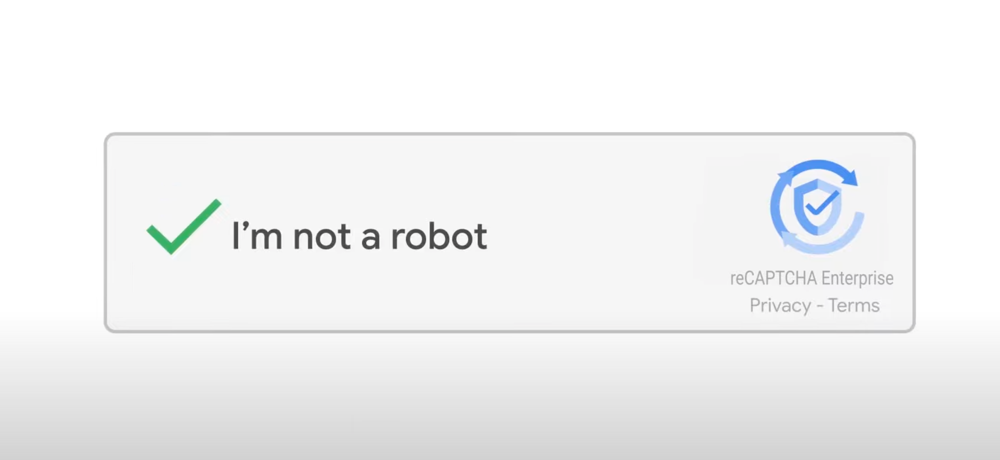

# Hi there 👋
I'm Youngho!

## features
- [**lazy evaluation**](https://en.wikipedia.org/wiki/Lazy_evaluation)  
  I'm lazy. But I will do my job until deadline!
- **I'm not a 🤖**  
  My friends call me `robot`.  
  Because I don't express my emotions well.  
  But I'm NOT a _robot_!  
  

## I'm interested in
- OS
- Linux 🐧 (favorite: Arch Linux)
- zfs, btrfs
- docker
- System Programing
- Embedded
- Raspberry pi pico
- Robotics 🤖
- 3D Printing
- C
- Rust 😘
- Haskell 🤯
- Elixir

## Look around!
- [Gerraly](https://gerraly.cho0h5.org)
- [unstructured log](https://blog.naver.com/cho0h5)

## monitoring

