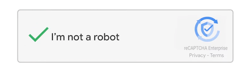

# Hi there 👋
I'm Youngho!

## features
- I love computer. Specifically, I'm interested in low-level like kernel.
- [**lazy evaluation**](https://en.wikipedia.org/wiki/Lazy_evaluation)  
  I'm lazy, because I do what I want to do.  
  But I will do my job until deadline!
- **I'm not a 🤖**  
  My friends call me `robot`.  
  Because I don't express my emotions well.  
  But I'm NOT a _robot_!  
  

## I'm interested in
- Linux 🐧
  - favorite: Arch Linux, Fedora
  - zfs, btrfs
  - docker
- Vim
  - I can't write code without vim 🤓
- Embedded
  - favorite chip: raspberry pi pico (well-documented and various feature)
- Robotics 🤖
- Languages
  - C (根本)
  - Rust 😘 (Rust is perfect language)
  - Haskell 🤯 (I want to be fluent in Haskell)
  - Go (Goroutine is pretty cool)

## Look around!
- [bong compiler](https://cho0h5.github.io/bong-compiler)
- [naver blog](https://blog.naver.com/cho0h5)
- [Gerraly](https://cho0h5.github.io/gerraly)
